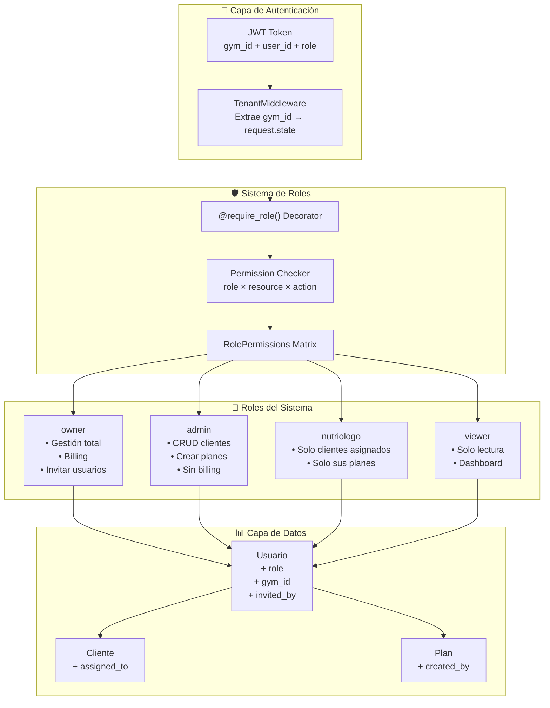
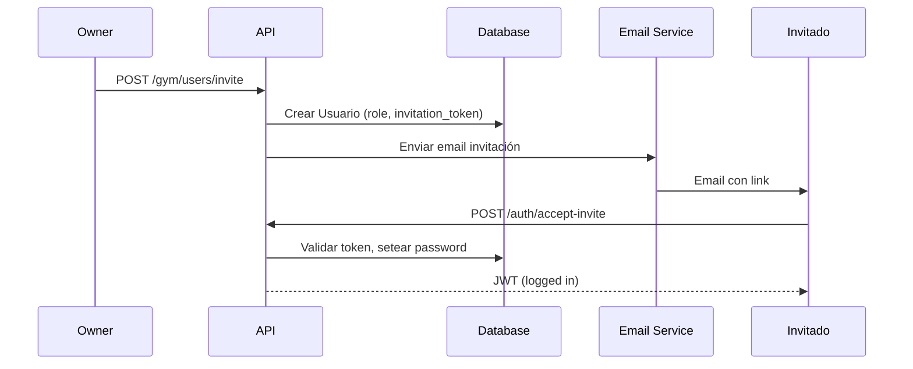

# 🏛️ Arquitectura RBAC - MetodoBase SaaS

**Fecha:** 2026-03-24  
**Versión:** 1.0  
**Autor:** Arquitecto Senior  

---

## 📋 Índice

1. [Análisis del Código Actual](#1-análisis-del-código-actual)
2. [Arquitectura Propuesta](#2-arquitectura-propuesta)
3. [Cambios a Modelos](#3-cambios-a-modelos)
4. [Schemas Pydantic](#4-schemas-pydantic)
5. [Nuevos Endpoints](#5-nuevos-endpoints)
6. [Decorador de Permisos](#6-decorador-de-permisos)
7. [Consideraciones de Seguridad](#7-consideraciones-de-seguridad)
8. [Plan de Migración](#8-plan-de-migración)

---

## 1. Análisis del Código Actual

### 1.1 Modelo Usuario Actual (`web/database/models.py`)

```python
class Usuario(Base):
    __tablename__ = "usuarios"
    
    id = Column(String(36), primary_key=True)
    email = Column(String(255), nullable=False, unique=True)
    password_hash = Column(String(255), nullable=False)
    nombre = Column(String(150), nullable=False)
    apellido = Column(String(150), nullable=False, default="")
    tipo = Column(String(20), nullable=False, default="usuario")  # gym | usuario | admin
    activo = Column(Boolean, nullable=False, default=True)
    fecha_registro = Column(DateTime, nullable=False)
```

**Limitaciones identificadas:**
- ❌ Campo `tipo` mixto: confunde tipo de cuenta (`gym`) con roles (`admin`)
- ❌ No hay concepto de "miembros de un gym" (team members)
- ❌ No hay relación FK para pertenencia a gym
- ❌ No hay sistema de invitaciones

### 1.2 Sistema de Autenticación (`web/auth.py`)

```python
def crear_access_token(usuario: dict) -> str:
    payload = {
        "id": usuario["id"],
        "email": usuario["email"],
        "nombre": usuario["nombre"],
        "tipo": usuario["tipo"],  # Solo tipo, no rol
        "exp": exp,
        "type": "access",
    }
```

**Puntos fuertes:**
- ✅ bcrypt para hashing
- ✅ HMAC-SHA256 para tokens
- ✅ Refresh token rotation
- ✅ Token revocation

**Gaps:**
- ❌ No incluye `role` en JWT
- ❌ No incluye `gym_id` para members

### 1.3 TenantMiddleware (`web/middleware/tenant.py`)

```python
async def _extract_tenant(self, request: Request) -> str | None:
    if payload and payload.get("tipo") in ("gym", "admin"):
        return payload.get("id")  # Solo owners son tenants
```

**Punto crítico:** El middleware asume que `tipo=gym` significa owner del gym. Esto funcionó cuando solo había owners, pero no escala a equipos.

### 1.4 Auth Dependencies (`web/auth_deps.py`)

```python
def get_usuario_gym(usuario=Depends(get_usuario_actual)):
    if usuario.get("tipo") not in ("gym", "admin"):
        raise HTTPException(403, "Acceso permitido solo para Socios Comerciales.")
    return usuario
```

**Limitación:** Binario (gym/admin o nada). No hay granularidad de roles.

---

## 2. Arquitectura Propuesta

### 2.1 Diagrama de Arquitectura



### 2.2 Matriz de Permisos

| Permiso | owner | admin | nutriologo | viewer |
|---------|:-----:|:-----:|:----------:|:------:|
| Ver dashboard | ✅ | ✅ | ✅ | ✅ |
| CRUD clientes (todos) | ✅ | ✅ | ❌ | ❌ |
| CRUD clientes (asignados) | ✅ | ✅ | ✅ | ❌ |
| Crear planes | ✅ | ✅ | ✅* | ❌ |
| Exportar (todos) | ✅ | ✅ | ❌ | ❌ |
| Exportar (propios) | ✅ | ✅ | ✅ | ❌ |
| Gestión usuarios (CRUD) | ✅ | ❌ | ❌ | ❌ |
| Invitar usuarios | ✅ | ❌ | ❌ | ❌ |
| Billing/Subscription | ✅ | ❌ | ❌ | ❌ |
| Configuración gym | ✅ | ✅ | ❌ | ❌ |

*Solo para clientes asignados

### 2.3 Flujo de Invitación



---

## 3. Cambios a Modelos

### 3.1 Enum de Roles

```python
# web/database/enums.py (NUEVO)
from enum import Enum

class UserRole(str, Enum):
    """Roles dentro de un gym (tenant)."""
    OWNER = "owner"        # Dueño del gym
    ADMIN = "admin"        # Administrador (sin billing)
    NUTRIOLOGO = "nutriologo"  # Nutriólogo (solo clientes asignados)
    VIEWER = "viewer"      # Solo lectura

class AccountType(str, Enum):
    """Tipo de cuenta (separado de rol)."""
    GYM = "gym"           # Cuenta gym (el owner inicial)
    MEMBER = "member"     # Miembro de un gym
    SUPERADMIN = "superadmin"  # Admin de plataforma
```

### 3.2 Usuario Actualizado

```python
# web/database/models.py — CAMBIOS

class Usuario(Base):
    __tablename__ = "usuarios"

    id = Column(String(36), primary_key=True, default=lambda: str(uuid.uuid4()))
    email = Column(String(255), nullable=False, unique=True, index=True)
    password_hash = Column(String(255), nullable=True)  # NULL hasta aceptar invitación
    nombre = Column(String(150), nullable=False)
    apellido = Column(String(150), nullable=False, default="")
    
    # ── NUEVO: Separar tipo de cuenta vs rol ──
    account_type = Column(
        String(20), 
        nullable=False, 
        default="member",
    )
    
    role = Column(
        String(20), 
        nullable=False, 
        default="viewer",
    )
    
    # ── NUEVO: Pertenencia a gym (multi-tenant) ──
    gym_id = Column(
        String(36), 
        ForeignKey("usuarios.id", ondelete="CASCADE"), 
        nullable=True,  # NULL = es owner (self-referencing)
        index=True,
    )
    
    # ── NUEVO: Sistema de invitaciones ──
    invited_by = Column(
        String(36), 
        ForeignKey("usuarios.id", ondelete="SET NULL"), 
        nullable=True,
    )
    invitation_token = Column(String(64), nullable=True, unique=True, index=True)
    invitation_expires = Column(DateTime, nullable=True)
    invitation_accepted_at = Column(DateTime, nullable=True)
    
    # ── Existentes ──
    activo = Column(Boolean, nullable=False, default=True)
    fecha_registro = Column(DateTime, nullable=False, default=datetime.utcnow)
    
    # ── Relaciones ──
    gym = relationship("Usuario", remote_side=[id], foreign_keys=[gym_id], backref="members")
    inviter = relationship("Usuario", remote_side=[id], foreign_keys=[invited_by])
    refresh_tokens = relationship("RefreshToken", back_populates="usuario", cascade="all, delete-orphan")
    clientes = relationship("Cliente", back_populates="gym", foreign_keys="[Cliente.gym_id]")
    
    # Clientes asignados (para nutriólogos)
    assigned_clientes = relationship(
        "Cliente", 
        secondary="cliente_assignments",
        back_populates="assigned_users",
    )

    __table_args__ = (
        CheckConstraint(
            "account_type IN ('gym', 'member', 'superadmin')", 
            name="ck_usuario_account_type"
        ),
        CheckConstraint(
            "role IN ('owner', 'admin', 'nutriologo', 'viewer')", 
            name="ck_usuario_role"
        ),
        # Owner debe tener gym_id NULL (es el gym)
        CheckConstraint(
            "(role != 'owner') OR (gym_id IS NULL)", 
            name="ck_owner_no_gym_id"
        ),
        Index("ix_usuarios_gym_role", "gym_id", "role"),
    )
    
    @property
    def is_owner(self) -> bool:
        return self.role == "owner"
    
    @property
    def effective_gym_id(self) -> str:
        """Retorna el gym_id efectivo (para owners es su propio id)."""
        return self.gym_id if self.gym_id else self.id
```

### 3.3 Tabla de Asignación Cliente ↔ Usuario

```python
# web/database/models.py — AGREGAR

class ClienteAssignment(Base):
    """
    Asignación de clientes a usuarios (nutriólogos).
    Permite que un nutriólogo solo vea/edite clientes específicos.
    """
    __tablename__ = "cliente_assignments"
    
    id = Column(Integer, primary_key=True, autoincrement=True)
    cliente_id = Column(
        String(36), 
        ForeignKey("clientes.id_cliente", ondelete="CASCADE"), 
        nullable=False,
    )
    user_id = Column(
        String(36), 
        ForeignKey("usuarios.id", ondelete="CASCADE"), 
        nullable=False,
    )
    assigned_at = Column(DateTime, default=datetime.utcnow)
    assigned_by = Column(
        String(36), 
        ForeignKey("usuarios.id", ondelete="SET NULL"), 
        nullable=True,
    )
    
    __table_args__ = (
        Index("ix_assignments_cliente", "cliente_id"),
        Index("ix_assignments_user", "user_id"),
        # Un cliente solo puede estar asignado una vez a cada usuario
        Index("uq_cliente_user", "cliente_id", "user_id", unique=True),
    )
```

### 3.4 Actualizar Cliente

```python
# web/database/models.py — MODIFICAR Cliente

class Cliente(Base):
    __tablename__ = "clientes"
    
    # ... campos existentes ...
    
    # NUEVO: Quién creó el cliente
    created_by = Column(
        String(36), 
        ForeignKey("usuarios.id", ondelete="SET NULL"), 
        nullable=True,
    )
    
    # Relación con usuarios asignados
    assigned_users = relationship(
        "Usuario",
        secondary="cliente_assignments",
        back_populates="assigned_clientes",
    )
```

### 3.5 Actualizar PlanGenerado

```python
# web/database/models.py — MODIFICAR PlanGenerado

class PlanGenerado(Base):
    __tablename__ = "planes_generados"
    
    # ... campos existentes ...
    
    # NUEVO: Quién generó el plan
    created_by = Column(
        String(36), 
        ForeignKey("usuarios.id", ondelete="SET NULL"), 
        nullable=True,
    )
```

---

## 4. Schemas Pydantic

### 4.1 Enums y Base

```python
# web/schemas/rbac.py (NUEVO)
from datetime import datetime
from enum import Enum
from typing import Optional, List
from pydantic import BaseModel, EmailStr, Field


class UserRole(str, Enum):
    OWNER = "owner"
    ADMIN = "admin"
    NUTRIOLOGO = "nutriologo"
    VIEWER = "viewer"


class AccountType(str, Enum):
    GYM = "gym"
    MEMBER = "member"
    SUPERADMIN = "superadmin"
```

### 4.2 Schemas de Invitación

```python
class InviteUserRequest(BaseModel):
    """Request para invitar un nuevo miembro al gym."""
    email: EmailStr
    nombre: str = Field(..., min_length=2, max_length=150)
    apellido: str = Field("", max_length=150)
    role: UserRole = Field(default=UserRole.VIEWER)
    
    class Config:
        json_schema_extra = {
            "example": {
                "email": "nutriologo@ejemplo.com",
                "nombre": "Dr. Juan",
                "apellido": "Pérez",
                "role": "nutriologo"
            }
        }


class InviteUserResponse(BaseModel):
    """Response de invitación creada."""
    success: bool
    user_id: str
    email: str
    role: UserRole
    invitation_expires: datetime
    message: str


class AcceptInviteRequest(BaseModel):
    """Request para aceptar invitación."""
    token: str = Field(..., min_length=32, max_length=64)
    password: str = Field(..., min_length=8, max_length=128)
    
    class Config:
        json_schema_extra = {
            "example": {
                "token": "abc123...",
                "password": "SecurePassword123!"
            }
        }
```

### 4.3 Schemas de Usuarios del Gym

```python
class GymMemberResponse(BaseModel):
    """Representación de un miembro del gym."""
    id: str
    email: str
    nombre: str
    apellido: str
    role: UserRole
    activo: bool
    fecha_registro: datetime
    invitation_accepted_at: Optional[datetime]
    invited_by_name: Optional[str]
    assigned_clientes_count: int = 0


class GymMembersListResponse(BaseModel):
    """Lista de miembros del gym."""
    members: List[GymMemberResponse]
    total: int
    active_count: int
    pending_invitations: int


class UpdateMemberRoleRequest(BaseModel):
    """Request para cambiar rol de un miembro."""
    role: UserRole
    
    class Config:
        json_schema_extra = {
            "example": {"role": "admin"}
        }


class AssignClientesRequest(BaseModel):
    """Request para asignar clientes a un usuario."""
    cliente_ids: List[str] = Field(..., min_items=1)
    
    class Config:
        json_schema_extra = {
            "example": {
                "cliente_ids": ["uuid-1", "uuid-2"]
            }
        }
```

### 4.4 Schemas de Usuario Auth (Actualizado)

```python
class UserInToken(BaseModel):
    """Datos del usuario incluidos en JWT."""
    id: str
    email: str
    nombre: str
    tipo: AccountType  # Renombrar para claridad
    role: UserRole
    gym_id: str  # Siempre presente (owner = su propio id)


class TokenResponse(BaseModel):
    """Response de login/registro."""
    token: str
    refresh_token: str
    tipo: AccountType
    role: UserRole
    gym_id: str
    nombre: str
    email: str
```

---

## 5. Nuevos Endpoints

### 5.1 Gestión de Usuarios del Gym

```python
# web/routes/gym_users.py (NUEVO)
from fastapi import APIRouter, Depends, HTTPException, BackgroundTasks
from sqlalchemy.orm import Session

from web.database.engine import get_db
from web.auth_deps import get_usuario_actual
from web.rbac import require_role, UserRole
from web.schemas.rbac import (
    InviteUserRequest, InviteUserResponse,
    GymMembersListResponse, GymMemberResponse,
    UpdateMemberRoleRequest, AssignClientesRequest,
)

router = APIRouter(prefix="/gym/users", tags=["Gym Users"])


@router.post("/invite", response_model=InviteUserResponse)
async def invite_user(
    data: InviteUserRequest,
    background_tasks: BackgroundTasks,
    db: Session = Depends(get_db),
    current_user: dict = Depends(require_role(UserRole.OWNER)),
):
    """
    Invita un nuevo usuario al gym.
    
    - Solo el **owner** puede invitar
    - Genera token de invitación válido por 7 días
    - Envía email con link de aceptación
    """
    ...


@router.get("", response_model=GymMembersListResponse)
async def list_gym_members(
    include_pending: bool = True,
    db: Session = Depends(get_db),
    current_user: dict = Depends(require_role(UserRole.OWNER)),
):
    """
    Lista todos los miembros del gym.
    
    - Solo **owner** puede ver la lista completa
    - Incluye invitaciones pendientes si `include_pending=true`
    """
    ...


@router.get("/{user_id}", response_model=GymMemberResponse)
async def get_gym_member(
    user_id: str,
    db: Session = Depends(get_db),
    current_user: dict = Depends(require_role(UserRole.OWNER)),
):
    """Obtiene detalles de un miembro específico."""
    ...


@router.patch("/{user_id}/role")
async def update_member_role(
    user_id: str,
    data: UpdateMemberRoleRequest,
    db: Session = Depends(get_db),
    current_user: dict = Depends(require_role(UserRole.OWNER)),
):
    """
    Cambia el rol de un miembro.
    
    - No se puede cambiar el rol del owner
    - No se puede promover a owner (solo transferir)
    """
    ...


@router.delete("/{user_id}")
async def remove_gym_member(
    user_id: str,
    db: Session = Depends(get_db),
    current_user: dict = Depends(require_role(UserRole.OWNER)),
):
    """
    Elimina un miembro del gym.
    
    - El owner no puede eliminarse a sí mismo
    - Reasigna clientes huérfanos al owner
    """
    ...


@router.post("/{user_id}/assign-clientes")
async def assign_clientes_to_user(
    user_id: str,
    data: AssignClientesRequest,
    db: Session = Depends(get_db),
    current_user: dict = Depends(require_role(UserRole.OWNER, UserRole.ADMIN)),
):
    """
    Asigna clientes a un nutriólogo.
    
    - Owner y admin pueden asignar
    - Solo tiene efecto para rol nutriólogo
    """
    ...


@router.delete("/{user_id}/assign-clientes/{cliente_id}")
async def unassign_cliente(
    user_id: str,
    cliente_id: str,
    db: Session = Depends(get_db),
    current_user: dict = Depends(require_role(UserRole.OWNER, UserRole.ADMIN)),
):
    """Desasigna un cliente de un usuario."""
    ...


@router.post("/resend-invite/{user_id}")
async def resend_invitation(
    user_id: str,
    background_tasks: BackgroundTasks,
    db: Session = Depends(get_db),
    current_user: dict = Depends(require_role(UserRole.OWNER)),
):
    """Reenvía email de invitación (genera nuevo token)."""
    ...
```

### 5.2 Endpoint de Aceptar Invitación

```python
# web/routes/auth_routes.py (AGREGAR)

@router.post("/accept-invite")
async def accept_invitation(
    data: AcceptInviteRequest,
    db: Session = Depends(get_db),
):
    """
    Acepta invitación y establece contraseña.
    
    - Token debe ser válido y no expirado
    - Retorna JWT (usuario queda logueado)
    
    Rate limit: 5 intentos por hora por IP
    """
    ...
```

### 5.3 Transferir Ownership

```python
@router.post("/transfer-ownership/{new_owner_id}")
async def transfer_ownership(
    new_owner_id: str,
    db: Session = Depends(get_db),
    current_user: dict = Depends(require_role(UserRole.OWNER)),
):
    """
    Transfiere ownership del gym a otro miembro.
    
    - Requiere doble confirmación (2FA o confirmación por email)
    - El owner actual pasa a ser admin
    - Irreversible sin intervención de soporte
    """
    ...
```

---

## 6. Decorador de Permisos

### 6.1 Implementación Core

```python
# web/rbac.py (NUEVO)
"""
Role-Based Access Control (RBAC) para MetodoBase SaaS.

Uso:
    @router.get("/clientes")
    def listar_clientes(
        current_user: dict = Depends(require_role(UserRole.ADMIN, UserRole.OWNER)),
    ):
        ...
    
    # O para verificar acceso a recurso específico
    @router.get("/clientes/{id}")
    def obtener_cliente(
        id: str,
        current_user: dict = Depends(require_role_and_resource("cliente", "read")),
    ):
        ...
"""
from enum import Enum
from functools import wraps
from typing import Callable, Optional, Set, Union

from fastapi import Depends, HTTPException, Request
from sqlalchemy.orm import Session

from web.auth_deps import get_usuario_actual
from web.database.engine import get_db


class UserRole(str, Enum):
    OWNER = "owner"
    ADMIN = "admin"
    NUTRIOLOGO = "nutriologo"
    VIEWER = "viewer"


class Permission(str, Enum):
    # Usuarios
    USERS_READ = "users:read"
    USERS_INVITE = "users:invite"
    USERS_UPDATE = "users:update"
    USERS_DELETE = "users:delete"
    
    # Clientes
    CLIENTES_READ_ALL = "clientes:read:all"
    CLIENTES_READ_ASSIGNED = "clientes:read:assigned"
    CLIENTES_CREATE = "clientes:create"
    CLIENTES_UPDATE_ALL = "clientes:update:all"
    CLIENTES_UPDATE_ASSIGNED = "clientes:update:assigned"
    CLIENTES_DELETE = "clientes:delete"
    
    # Planes
    PLANES_READ_ALL = "planes:read:all"
    PLANES_READ_ASSIGNED = "planes:read:assigned"
    PLANES_CREATE = "planes:create"
    PLANES_DELETE = "planes:delete"
    
    # Dashboard
    DASHBOARD_READ = "dashboard:read"
    DASHBOARD_EXPORT = "dashboard:export"
    
    # Billing
    BILLING_READ = "billing:read"
    BILLING_MANAGE = "billing:manage"
    
    # Config
    GYM_CONFIG_READ = "gym:config:read"
    GYM_CONFIG_UPDATE = "gym:config:update"


# Matriz de permisos por rol
ROLE_PERMISSIONS: dict[UserRole, Set[Permission]] = {
    UserRole.OWNER: {
        # Todos los permisos
        Permission.USERS_READ,
        Permission.USERS_INVITE,
        Permission.USERS_UPDATE,
        Permission.USERS_DELETE,
        Permission.CLIENTES_READ_ALL,
        Permission.CLIENTES_CREATE,
        Permission.CLIENTES_UPDATE_ALL,
        Permission.CLIENTES_DELETE,
        Permission.PLANES_READ_ALL,
        Permission.PLANES_CREATE,
        Permission.PLANES_DELETE,
        Permission.DASHBOARD_READ,
        Permission.DASHBOARD_EXPORT,
        Permission.BILLING_READ,
        Permission.BILLING_MANAGE,
        Permission.GYM_CONFIG_READ,
        Permission.GYM_CONFIG_UPDATE,
    },
    UserRole.ADMIN: {
        Permission.CLIENTES_READ_ALL,
        Permission.CLIENTES_CREATE,
        Permission.CLIENTES_UPDATE_ALL,
        Permission.CLIENTES_DELETE,
        Permission.PLANES_READ_ALL,
        Permission.PLANES_CREATE,
        Permission.PLANES_DELETE,
        Permission.DASHBOARD_READ,
        Permission.DASHBOARD_EXPORT,
        Permission.GYM_CONFIG_READ,
        Permission.GYM_CONFIG_UPDATE,
    },
    UserRole.NUTRIOLOGO: {
        Permission.CLIENTES_READ_ASSIGNED,
        Permission.CLIENTES_UPDATE_ASSIGNED,
        Permission.PLANES_READ_ASSIGNED,
        Permission.PLANES_CREATE,  # Solo para asignados (verificado en endpoint)
        Permission.DASHBOARD_READ,
    },
    UserRole.VIEWER: {
        Permission.DASHBOARD_READ,
        Permission.CLIENTES_READ_ALL,  # Read-only
        Permission.PLANES_READ_ALL,    # Read-only
    },
}


def has_permission(role: UserRole, permission: Permission) -> bool:
    """Verifica si un rol tiene un permiso específico."""
    return permission in ROLE_PERMISSIONS.get(role, set())


def require_role(*allowed_roles: UserRole) -> Callable:
    """
    Dependency que requiere uno de los roles especificados.
    
    Uso:
        @router.get("/billing")
        def get_billing(user = Depends(require_role(UserRole.OWNER))):
            ...
    """
    def dependency(
        current_user: dict = Depends(get_usuario_actual),
    ) -> dict:
        user_role = current_user.get("role")
        
        if not user_role:
            raise HTTPException(
                status_code=403,
                detail="Usuario sin rol asignado.",
            )
        
        try:
            role_enum = UserRole(user_role)
        except ValueError:
            raise HTTPException(
                status_code=403,
                detail=f"Rol inválido: {user_role}",
            )
        
        if role_enum not in allowed_roles:
            raise HTTPException(
                status_code=403,
                detail=f"Acceso denegado. Roles permitidos: {[r.value for r in allowed_roles]}",
            )
        
        return current_user
    
    return dependency


def require_permission(permission: Permission) -> Callable:
    """
    Dependency que requiere un permiso específico.
    
    Uso:
        @router.post("/users/invite")
        def invite(user = Depends(require_permission(Permission.USERS_INVITE))):
            ...
    """
    def dependency(
        current_user: dict = Depends(get_usuario_actual),
    ) -> dict:
        user_role = current_user.get("role")
        
        try:
            role_enum = UserRole(user_role)
        except (ValueError, TypeError):
            raise HTTPException(
                status_code=403,
                detail="Rol de usuario inválido.",
            )
        
        if not has_permission(role_enum, permission):
            raise HTTPException(
                status_code=403,
                detail=f"Permiso requerido: {permission.value}",
            )
        
        return current_user
    
    return dependency


class ResourceChecker:
    """
    Verifica acceso a recursos específicos (clientes, planes).
    
    Uso:
        checker = ResourceChecker(db, current_user)
        if not checker.can_access_cliente(cliente_id):
            raise HTTPException(403, "No tienes acceso a este cliente")
    """
    
    def __init__(self, db: Session, user: dict):
        self.db = db
        self.user = user
        self.user_id = user["id"]
        self.gym_id = user["gym_id"]
        self.role = UserRole(user["role"])
    
    def can_access_cliente(self, cliente_id: str) -> bool:
        """Verifica si el usuario puede acceder a un cliente."""
        # Owner y Admin pueden acceder a todos los clientes del gym
        if self.role in (UserRole.OWNER, UserRole.ADMIN):
            return self._cliente_belongs_to_gym(cliente_id)
        
        # Viewer puede leer todos
        if self.role == UserRole.VIEWER:
            return self._cliente_belongs_to_gym(cliente_id)
        
        # Nutriólogo solo clientes asignados
        if self.role == UserRole.NUTRIOLOGO:
            return self._cliente_is_assigned(cliente_id)
        
        return False
    
    def can_modify_cliente(self, cliente_id: str) -> bool:
        """Verifica si el usuario puede modificar un cliente."""
        if self.role == UserRole.VIEWER:
            return False
        
        if self.role in (UserRole.OWNER, UserRole.ADMIN):
            return self._cliente_belongs_to_gym(cliente_id)
        
        if self.role == UserRole.NUTRIOLOGO:
            return self._cliente_is_assigned(cliente_id)
        
        return False
    
    def _cliente_belongs_to_gym(self, cliente_id: str) -> bool:
        """Verifica que el cliente pertenezca al gym."""
        from web.database.models import Cliente
        cliente = self.db.query(Cliente).filter(
            Cliente.id_cliente == cliente_id,
            Cliente.gym_id == self.gym_id,
        ).first()
        return cliente is not None
    
    def _cliente_is_assigned(self, cliente_id: str) -> bool:
        """Verifica que el cliente esté asignado al usuario."""
        from web.database.models import ClienteAssignment
        assignment = self.db.query(ClienteAssignment).filter(
            ClienteAssignment.cliente_id == cliente_id,
            ClienteAssignment.user_id == self.user_id,
        ).first()
        return assignment is not None


def get_resource_checker(
    db: Session = Depends(get_db),
    current_user: dict = Depends(get_usuario_actual),
) -> ResourceChecker:
    """Dependency que proporciona un ResourceChecker configurado."""
    return ResourceChecker(db, current_user)
```

### 6.2 Ejemplo de Uso en Endpoints

```python
# web/routes/clientes.py — ACTUALIZADO

from web.rbac import (
    require_role, require_permission, 
    get_resource_checker, ResourceChecker,
    UserRole, Permission,
)

@router.get("/clientes", summary="Listar clientes")
def listar_clientes(
    q: Optional[str] = Query(None),
    limite: int = Query(100, ge=1, le=500),
    db: Session = Depends(get_db),
    current_user: dict = Depends(get_usuario_actual),
    checker: ResourceChecker = Depends(get_resource_checker),
):
    """
    Lista clientes según rol:
    - owner/admin/viewer: todos los clientes del gym
    - nutriologo: solo clientes asignados
    """
    role = UserRole(current_user["role"])
    gym_id = current_user["gym_id"]
    
    if role == UserRole.NUTRIOLOGO:
        # Solo clientes asignados
        clientes, total = repo.listar_clientes_asignados(
            db, current_user["id"], q, limite
        )
    else:
        # Todos los clientes del gym
        clientes, total = repo.listar_clientes(db, gym_id, q, limite)
    
    return {"clientes": clientes, "total": total}


@router.post("/clientes", status_code=201)
def crear_cliente(
    data: ClienteCreate,
    db: Session = Depends(get_db),
    current_user: dict = Depends(require_permission(Permission.CLIENTES_CREATE)),
):
    """Crea cliente. Nutriólogos lo tienen auto-asignado."""
    gym_id = current_user["gym_id"]
    cliente = repo.crear_cliente(db, gym_id, data.model_dump())
    
    # Auto-asignar si es nutriólogo
    if current_user["role"] == UserRole.NUTRIOLOGO.value:
        repo.asignar_cliente(db, cliente["id_cliente"], current_user["id"])
    
    return {"success": True, "cliente": cliente}


@router.put("/clientes/{id_cliente}")
def actualizar_cliente(
    id_cliente: str,
    data: ClienteUpdate,
    db: Session = Depends(get_db),
    current_user: dict = Depends(get_usuario_actual),
    checker: ResourceChecker = Depends(get_resource_checker),
):
    """Actualiza cliente si tiene acceso."""
    if not checker.can_modify_cliente(id_cliente):
        raise HTTPException(403, "No tienes permiso para modificar este cliente")
    
    result = repo.actualizar_cliente(
        db, current_user["gym_id"], id_cliente, data.model_dump()
    )
    return result
```

---

## 7. Consideraciones de Seguridad

### 7.1 Tokens JWT Actualizados

```python
def crear_access_token(usuario: dict) -> str:
    """Genera access token con rol y gym_id."""
    exp = time.time() + ACCESS_TOKEN_EXPIRE_MINUTES * 60
    
    # Calcular effective gym_id
    gym_id = usuario.get("gym_id") or usuario["id"]
    
    payload = {
        "id": usuario["id"],
        "email": usuario["email"],
        "nombre": usuario["nombre"],
        "tipo": usuario["account_type"],  # gym | member | superadmin
        "role": usuario["role"],          # owner | admin | nutriologo | viewer
        "gym_id": gym_id,                 # Siempre presente
        "exp": exp,
        "type": "access",
    }
    return _make_token(payload)
```

### 7.2 Validaciones de Seguridad

```python
# Validaciones para implementar en cada endpoint

class SecurityChecks:
    """Validaciones de seguridad centralizadas."""
    
    @staticmethod
    def validate_same_gym(user: dict, target_gym_id: str) -> None:
        """Verifica que el usuario pertenezca al gym."""
        if user["gym_id"] != target_gym_id:
            raise HTTPException(403, "Acceso denegado a este gym")
    
    @staticmethod
    def validate_not_self(user: dict, target_user_id: str) -> None:
        """Previene operaciones sobre sí mismo."""
        if user["id"] == target_user_id:
            raise HTTPException(400, "No puedes realizar esta acción sobre ti mismo")
    
    @staticmethod
    def validate_not_owner_demotion(db: Session, target_user_id: str) -> None:
        """Previene degradar al owner."""
        from web.database.models import Usuario
        target = db.query(Usuario).filter(Usuario.id == target_user_id).first()
        if target and target.role == "owner":
            raise HTTPException(400, "No se puede modificar el rol del owner")
    
    @staticmethod
    def validate_invitation_token(token: str, db: Session) -> Optional[dict]:
        """Valida token de invitación."""
        from web.database.models import Usuario
        from datetime import datetime
        
        user = db.query(Usuario).filter(
            Usuario.invitation_token == token,
            Usuario.invitation_expires > datetime.utcnow(),
            Usuario.invitation_accepted_at.is_(None),
        ).first()
        
        if not user:
            return None
        
        return {
            "id": user.id,
            "email": user.email,
            "nombre": user.nombre,
            "gym_id": user.gym_id,
            "role": user.role,
        }
```

### 7.3 Rate Limiting por Endpoint

```python
# Configuración de rate limits por endpoint sensible

RATE_LIMITS = {
    "/api/auth/login-gym": "10/minute",
    "/api/auth/login-usuario": "10/minute",
    "/api/auth/accept-invite": "5/hour",
    "/api/gym/users/invite": "20/hour",
    "/api/gym/users/transfer-ownership": "1/day",
}
```

### 7.4 Audit Log

```python
# web/database/models.py — AGREGAR

class AuditLog(Base):
    """Log de auditoría para acciones sensibles."""
    __tablename__ = "audit_logs"
    
    id = Column(Integer, primary_key=True, autoincrement=True)
    gym_id = Column(String(36), ForeignKey("usuarios.id"), nullable=False, index=True)
    user_id = Column(String(36), ForeignKey("usuarios.id"), nullable=False)
    action = Column(String(50), nullable=False)  # invite_user, delete_user, change_role...
    target_type = Column(String(30))  # user, cliente, plan
    target_id = Column(String(36))
    details = Column(Text)  # JSON con detalles
    ip_address = Column(String(45))
    user_agent = Column(String(255))
    created_at = Column(DateTime, default=datetime.utcnow)
    
    __table_args__ = (
        Index("ix_audit_gym_created", "gym_id", "created_at"),
        Index("ix_audit_user_action", "user_id", "action"),
    )
```

---

## 8. Plan de Migración (Alembic)

### 8.1 Migración 1: Agregar columnas a Usuario

```python
# alembic/versions/001_add_rbac_columns.py
"""Add RBAC columns to usuarios table.

Revision ID: 001_rbac_cols
Revises: (previous migration)
Create Date: 2026-03-24
"""
from alembic import op
import sqlalchemy as sa


revision = '001_rbac_cols'
down_revision = None  # Ajustar
branch_labels = None
depends_on = None


def upgrade():
    # 1. Agregar columnas con defaults temporales
    op.add_column('usuarios', sa.Column('account_type', sa.String(20), nullable=True))
    op.add_column('usuarios', sa.Column('role', sa.String(20), nullable=True))
    op.add_column('usuarios', sa.Column('gym_id', sa.String(36), nullable=True))
    op.add_column('usuarios', sa.Column('invited_by', sa.String(36), nullable=True))
    op.add_column('usuarios', sa.Column('invitation_token', sa.String(64), nullable=True))
    op.add_column('usuarios', sa.Column('invitation_expires', sa.DateTime(), nullable=True))
    op.add_column('usuarios', sa.Column('invitation_accepted_at', sa.DateTime(), nullable=True))
    
    # 2. Migrar datos existentes
    # tipo='gym' -> account_type='gym', role='owner'
    # tipo='usuario' -> account_type='member', role='viewer' (sin gym asignado aún)
    # tipo='admin' -> account_type='superadmin', role='owner'
    op.execute("""
        UPDATE usuarios 
        SET account_type = CASE 
            WHEN tipo = 'gym' THEN 'gym'
            WHEN tipo = 'admin' THEN 'superadmin'
            ELSE 'member'
        END,
        role = CASE 
            WHEN tipo = 'gym' THEN 'owner'
            WHEN tipo = 'admin' THEN 'owner'
            ELSE 'viewer'
        END
    """)
    
    # 3. Hacer columnas NOT NULL
    op.alter_column('usuarios', 'account_type', nullable=False, server_default='member')
    op.alter_column('usuarios', 'role', nullable=False, server_default='viewer')
    
    # 4. Crear índices
    op.create_index('ix_usuarios_gym_role', 'usuarios', ['gym_id', 'role'])
    op.create_index('ix_usuarios_invitation_token', 'usuarios', ['invitation_token'], unique=True)
    
    # 5. Crear FKs
    op.create_foreign_key(
        'fk_usuarios_gym_id', 'usuarios', 'usuarios',
        ['gym_id'], ['id'], ondelete='CASCADE'
    )
    op.create_foreign_key(
        'fk_usuarios_invited_by', 'usuarios', 'usuarios',
        ['invited_by'], ['id'], ondelete='SET NULL'
    )
    
    # 6. Agregar constraints
    op.create_check_constraint(
        'ck_usuario_account_type',
        'usuarios',
        "account_type IN ('gym', 'member', 'superadmin')"
    )
    op.create_check_constraint(
        'ck_usuario_role',
        'usuarios',
        "role IN ('owner', 'admin', 'nutriologo', 'viewer')"
    )


def downgrade():
    # Revertir en orden inverso
    op.drop_constraint('ck_usuario_role', 'usuarios', type_='check')
    op.drop_constraint('ck_usuario_account_type', 'usuarios', type_='check')
    op.drop_constraint('fk_usuarios_invited_by', 'usuarios', type_='foreignkey')
    op.drop_constraint('fk_usuarios_gym_id', 'usuarios', type_='foreignkey')
    op.drop_index('ix_usuarios_invitation_token', 'usuarios')
    op.drop_index('ix_usuarios_gym_role', 'usuarios')
    op.drop_column('usuarios', 'invitation_accepted_at')
    op.drop_column('usuarios', 'invitation_expires')
    op.drop_column('usuarios', 'invitation_token')
    op.drop_column('usuarios', 'invited_by')
    op.drop_column('usuarios', 'gym_id')
    op.drop_column('usuarios', 'role')
    op.drop_column('usuarios', 'account_type')
```

### 8.2 Migración 2: Tabla de asignaciones

```python
# alembic/versions/002_create_cliente_assignments.py
"""Create cliente_assignments table.

Revision ID: 002_assignments
Revises: 001_rbac_cols
Create Date: 2026-03-24
"""
from alembic import op
import sqlalchemy as sa


revision = '002_assignments'
down_revision = '001_rbac_cols'


def upgrade():
    op.create_table(
        'cliente_assignments',
        sa.Column('id', sa.Integer(), autoincrement=True, nullable=False),
        sa.Column('cliente_id', sa.String(36), nullable=False),
        sa.Column('user_id', sa.String(36), nullable=False),
        sa.Column('assigned_at', sa.DateTime(), nullable=True),
        sa.Column('assigned_by', sa.String(36), nullable=True),
        sa.ForeignKeyConstraint(['cliente_id'], ['clientes.id_cliente'], ondelete='CASCADE'),
        sa.ForeignKeyConstraint(['user_id'], ['usuarios.id'], ondelete='CASCADE'),
        sa.ForeignKeyConstraint(['assigned_by'], ['usuarios.id'], ondelete='SET NULL'),
        sa.PrimaryKeyConstraint('id'),
    )
    op.create_index('ix_assignments_cliente', 'cliente_assignments', ['cliente_id'])
    op.create_index('ix_assignments_user', 'cliente_assignments', ['user_id'])
    op.create_index('uq_cliente_user', 'cliente_assignments', ['cliente_id', 'user_id'], unique=True)


def downgrade():
    op.drop_table('cliente_assignments')
```

### 8.3 Migración 3: Columnas de tracking en clientes/planes

```python
# alembic/versions/003_add_created_by.py
"""Add created_by columns to clientes and planes.

Revision ID: 003_created_by
Revises: 002_assignments
Create Date: 2026-03-24
"""
from alembic import op
import sqlalchemy as sa


revision = '003_created_by'
down_revision = '002_assignments'


def upgrade():
    # Clientes
    op.add_column('clientes', sa.Column('created_by', sa.String(36), nullable=True))
    op.create_foreign_key(
        'fk_clientes_created_by', 'clientes', 'usuarios',
        ['created_by'], ['id'], ondelete='SET NULL'
    )
    
    # Planes
    op.add_column('planes_generados', sa.Column('created_by', sa.String(36), nullable=True))
    op.create_foreign_key(
        'fk_planes_created_by', 'planes_generados', 'usuarios',
        ['created_by'], ['id'], ondelete='SET NULL'
    )
    
    # Backfill: asignar created_by al gym owner
    op.execute("""
        UPDATE clientes c
        SET created_by = c.gym_id
        WHERE created_by IS NULL
    """)
    op.execute("""
        UPDATE planes_generados p
        SET created_by = p.gym_id
        WHERE created_by IS NULL
    """)


def downgrade():
    op.drop_constraint('fk_planes_created_by', 'planes_generados', type_='foreignkey')
    op.drop_column('planes_generados', 'created_by')
    op.drop_constraint('fk_clientes_created_by', 'clientes', type_='foreignkey')
    op.drop_column('clientes', 'created_by')
```

### 8.4 Migración 4: Audit log

```python
# alembic/versions/004_create_audit_log.py
"""Create audit_logs table.

Revision ID: 004_audit_log
Revises: 003_created_by
Create Date: 2026-03-24
"""
from alembic import op
import sqlalchemy as sa


revision = '004_audit_log'
down_revision = '003_created_by'


def upgrade():
    op.create_table(
        'audit_logs',
        sa.Column('id', sa.Integer(), autoincrement=True, nullable=False),
        sa.Column('gym_id', sa.String(36), nullable=False),
        sa.Column('user_id', sa.String(36), nullable=False),
        sa.Column('action', sa.String(50), nullable=False),
        sa.Column('target_type', sa.String(30), nullable=True),
        sa.Column('target_id', sa.String(36), nullable=True),
        sa.Column('details', sa.Text(), nullable=True),
        sa.Column('ip_address', sa.String(45), nullable=True),
        sa.Column('user_agent', sa.String(255), nullable=True),
        sa.Column('created_at', sa.DateTime(), nullable=True),
        sa.ForeignKeyConstraint(['gym_id'], ['usuarios.id']),
        sa.ForeignKeyConstraint(['user_id'], ['usuarios.id']),
        sa.PrimaryKeyConstraint('id'),
    )
    op.create_index('ix_audit_gym_created', 'audit_logs', ['gym_id', 'created_at'])
    op.create_index('ix_audit_user_action', 'audit_logs', ['user_id', 'action'])


def downgrade():
    op.drop_table('audit_logs')
```

### 8.5 Orden de Ejecución

```bash
# Ejecutar migraciones en orden
alembic upgrade 001_rbac_cols
alembic upgrade 002_assignments
alembic upgrade 003_created_by
alembic upgrade 004_audit_log

# O todo junto
alembic upgrade head
```

---

## 9. Checklist de Implementación

### Fase 1: Modelos y Migraciones (2-3 días)
- [ ] Crear `web/database/enums.py`
- [ ] Actualizar `web/database/models.py`
- [ ] Crear migraciones Alembic
- [ ] Ejecutar migraciones en staging
- [ ] Tests de schema

### Fase 2: RBAC Core (2-3 días)
- [ ] Crear `web/rbac.py`
- [ ] Actualizar JWT para incluir role y gym_id
- [ ] Actualizar TenantMiddleware para nuevos claims
- [ ] Tests unitarios de permisos

### Fase 3: Endpoints de Usuarios (2-3 días)
- [ ] Crear `web/routes/gym_users.py`
- [ ] Implementar invitaciones
- [ ] Implementar gestión de roles
- [ ] Tests de integración

### Fase 4: Actualizar Endpoints Existentes (3-4 días)
- [ ] `/api/clientes/*` - verificar permisos
- [ ] `/api/planes/*` - verificar permisos
- [ ] `/api/billing/*` - solo owner
- [ ] Tests E2E

### Fase 5: Frontend (4-5 días)
- [ ] UI de invitación de usuarios
- [ ] UI de gestión de equipo
- [ ] UI de asignación de clientes
- [ ] Ocultar acciones según rol

---

## 10. Consideraciones Adicionales

### 10.1 Escalabilidad

El diseño permite futuras extensiones:
- **Permisos granulares:** Agregar más `Permission` enum values
- **Roles custom:** Tabla separada `roles` con permisos configurables
- **Multi-gym:** Un usuario podría pertenecer a múltiples gyms con diferentes roles

### 10.2 Compatibilidad Backward

- Los tokens JWT existentes siguen funcionando (fallback a `owner` si no hay `role`)
- Se mantiene `tipo` en modelo para código legacy
- Migración gradual de endpoints

### 10.3 Testing

```python
# Fixture para tests
@pytest.fixture
def test_gym_with_team(db_session):
    """Crea gym con owner, admin y nutriólogo."""
    owner = Usuario(
        email="owner@test.com",
        password_hash=hash_password("test123"),
        nombre="Owner",
        account_type="gym",
        role="owner",
    )
    db_session.add(owner)
    db_session.flush()
    
    admin = Usuario(
        email="admin@test.com",
        password_hash=hash_password("test123"),
        nombre="Admin",
        account_type="member",
        role="admin",
        gym_id=owner.id,
        invited_by=owner.id,
    )
    
    nutriologo = Usuario(
        email="nutri@test.com",
        password_hash=hash_password("test123"),
        nombre="Nutriólogo",
        account_type="member",
        role="nutriologo",
        gym_id=owner.id,
        invited_by=owner.id,
    )
    
    db_session.add_all([admin, nutriologo])
    db_session.commit()
    
    return {"owner": owner, "admin": admin, "nutriologo": nutriologo}
```

---

## 📝 Resumen Ejecutivo

Este documento define la arquitectura RBAC para MetodoBase SaaS:

1. **4 roles:** owner, admin, nutriologo, viewer
2. **Permisos granulares** via matriz role → permissions
3. **Sistema de invitaciones** con tokens y expiración
4. **Asignación de clientes** para nutriólogos
5. **Decoradores** `@require_role()` y `@require_permission()`
6. **4 migraciones** Alembic incrementales
7. **Audit log** para compliance

El diseño es extensible, seguro y compatible con el sistema multi-tenant existente.
